# IS4302 Project - Blockchain-based Carbon Credit Ecosystem

IS4302 Blockchain and Distributed Ledger Technologies. A Blockchain-based Carbon Credit Ecosystem that facilitates the
exchange of carbon credits.

## 01 Use Case Description

Over the years, there has been exponential growth in carbon emissions worldwide. With no signs of slowing down, the
threat of global warming has been an increasing concern. This led governments around the world to experiment with
various methods to curb carbon emissions. One of which is establishing a carbon market through implementing a carbon
trading scheme, where carbon credits are traded, similar to a stock exchange. Each carbon credit is equivalent to
permitting the emission of 1 tonne of carbon dioxide. Participants who can reduce their emissions are able to sell their
credits to others, thereby incentivising them to continually do so to earn profit.

Through building an empathy map and user journey map of each stakeholder in the carbon market, our team has established
several pain points in the existing system. First, the emergence of an array of global and regional credits, markets and
trading mechanisms have led to a fragmented implementation of the trading scheme. With different coverage and accounting
standards across different trading schemes, markets are not standardised to a single rule and price, thus discouraging
the exchange of value across markets. The systems have also been criticised for the lack of transparency in carbon
reporting, resulting in over-crediting as well as double spending of carbon credits. Another significant problem is the
substantial transaction costs as traders and brokers often get a commission of 3 to 8 percent of the value of the
credit. Moreover, these schemes rely on third-party verifiers to check claims, who are often paid by the project
developers themselves, thereby incentivised to approve all clean projects they investigate. The combination of these
factors explain the limited impact of existing systems on climate change.

Thus, our team proposes a carbon token system utilising blockchain that is based on the fungible ERC777 token, to solve
these pain points in the existing system. By moving to the blockchain, we can eliminate the margins lost to liquidity
providers and bring more transparency, standardization and participation in the carbon market.

## 02 Architecture

### Roles

The following table lists the key stakeholders in the carbon market:

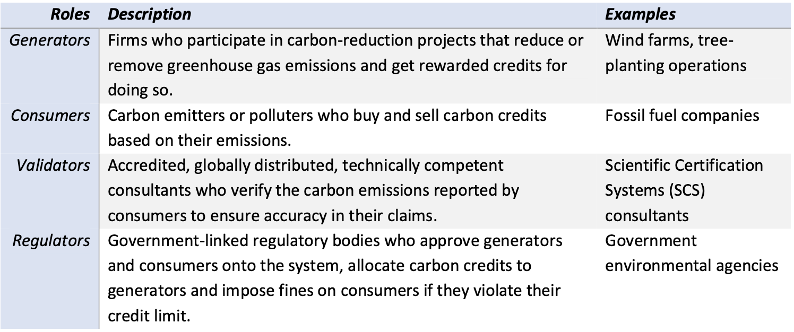

### Architectural & Design Choices

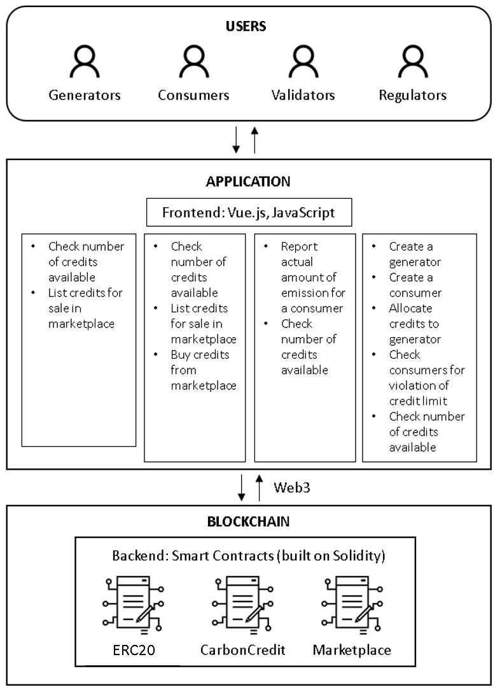

For the four different users of our blockchain web application, we will have different functions available for them.
Hence, the respective user interface will be displayed according to the login user type. The application will be built
on Vue.js and JavaScript frontend with Ethereum smart contracts being our backend. Vue.js is the preferred web framework
as it is lightweight and fast. Its modern user interface library allows us to quickly develop the web frontend. It is
highly customisable and will allow us to combine UI and behaviour of components within the script. Web3 will be used to
allow users to interact with the smart contracts on the blockchain from the web user interface. It simplifies work with
smart contracts by turning them into regular JavaScript objects.

### Contracts

Our smart contracts will be used to describe the functionalities of both our carbon credit token, and the carbon
exchange market in which the tokens will be traded. The 3 smart tokens to be deployed are as follows:

1. ERC20 Token: The ERC20 ethereum standard will be used as a basis for our carbon credit contract. Our choice was
   born out of the need for a fungible token, where tokens can be burnt (to allow reduction in carbon credit supply in
   the long-run).
2. Carbon Credit Contract: The carbon credit contract will be owned by the regulators, and will own all functionalities
   available to regulators and validators, such as allocation of credits and reporting emissions.
3. Carbon Credit Marketplace: The carbon credit marketplace contract acts as the carbon exchange market, where credits
   can be traded, with prices determined using an order book system, similar to real-world exchanges.

### Information Storage

Due to the goal of attaining full transparency in the carbon reporting, all data pertaining to our carbon market will be
stored on-chain. The key information that will be stored on-chain and their data structures are listed below:

*Carbon Credit Contract*
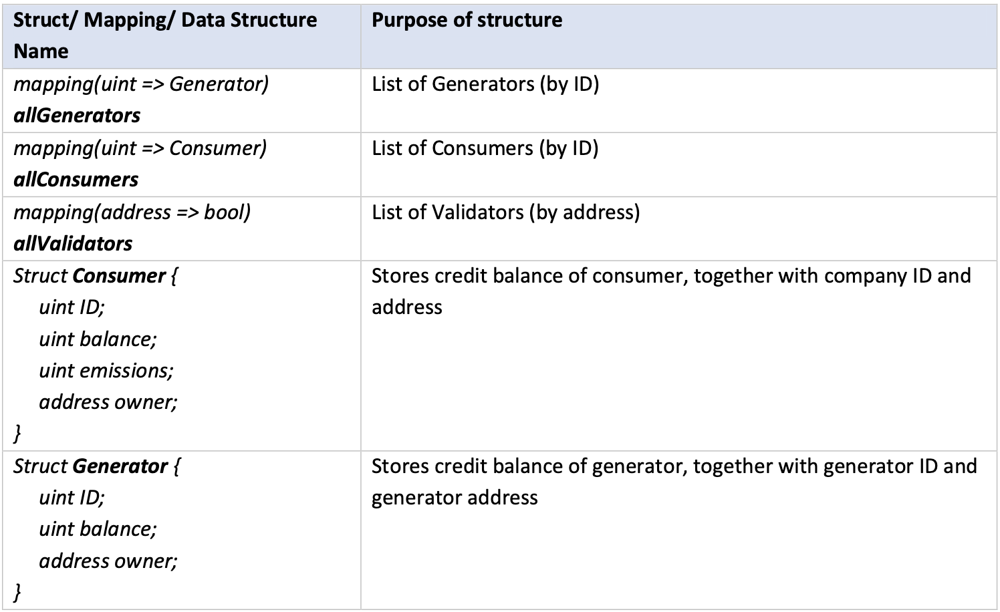

*Carbon Credit Marketplace Contract*
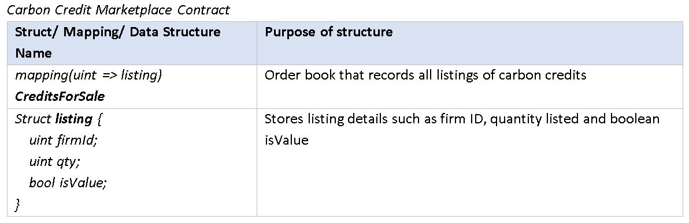

## 03 Functional & Access Control

*Carbon Credit Contract*
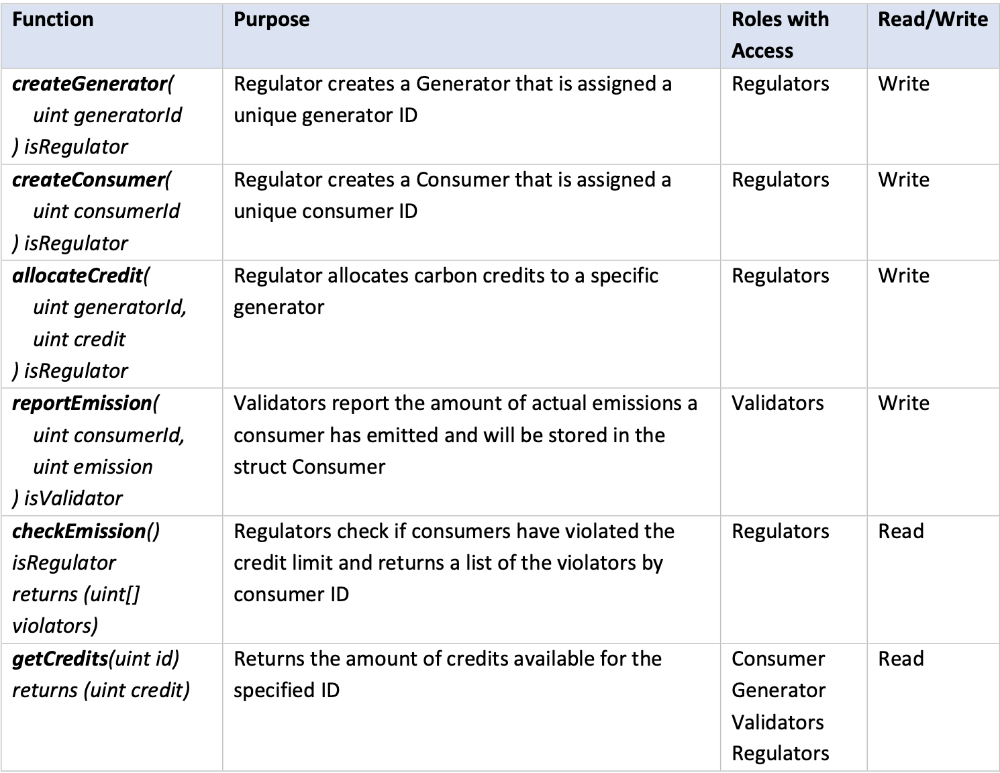

*Carbon Credit Marketplace Contract*
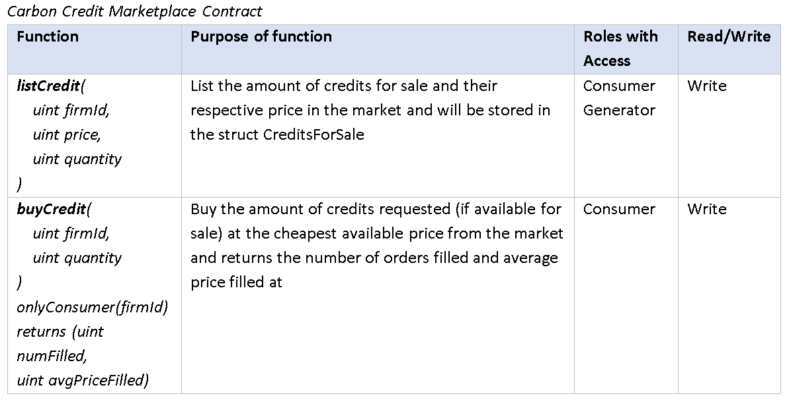
 
## 04 Privacy

Since our ecosystem does not involve the storage of sensitive information, there is no need for an off-chain database.
All information can and will be hosted on the blockchain network. By doing so, we are also ensuring that the carbon
market is a transparent system that is publicly available for everyone to view.

In regard to our smart contracts, we will be exercising access control by establishing different access rights for each
user role. In particular, retrieval (READ operations) and modification (WRITE operations) functions can only be executed
by certain user roles. These rules will be enforced through modifiers in the smart contracts and can be found in chapter
3 (Functional & Access Controls).

To secure our front-end, a basic login and authentication protocol will be established. Before usage, users will be
required to sign up with their personal ID and password to access the platform and its features. Depending on the role
of the user, the user will be directed to their respective views. In this case, there will be 4 different views for 4
different roles (consumers, generators, validators, regulators).

## 05 Summary

### Assumptions

1) Fines are done offline, by the regulators. Our system simply facilitates the trading of the carbon tokens; however,
   any fiat-based fines that are indicated by the system have to be settled offline.
2) Checking of actual emission levels are done offline, by the certified validators. This checking work is a specialized
   skill set that the validators are licensed to do. Be it checking of Consumers’ carbon emission levels, or Generators’
   recarbonization volumes, each certification has to be done by validators who physically check the validity of the
   claims.
3) Each carbon credit token represents the right to emit a certain fixed amount of CO2. These are represented by
   fungible tokens, and do not come in different denominations denoting different volume permits. This is a simplifying
   assumption to narrow the scope of our project.
4) Market forces are allowed to determine the price of the tokens; the regulators do not intervene in the markets. This
   is beneficial since now, firms can weigh the costs of green CAPEX against the cost of buying carbon credits, and
   hence the price of the tokens will settle at a level which makes sense in the free markets.
5) Firms, upon creation in our ecosystem, are granted a set number of tokens. This is not customised based on industry
   or differing needs, as would ideally be done in real life. We have chosen this to simplify our problem scope.

### Conclusion

Through our design, we are seeking to provide a proof-of-concept of how a carbon market would actually work on the
blockchain. The current system has many flaws - the market is fragmented and does not allow for efficient cross-border
exchange of value; there is over-crediting and unclear life cycle of carbon credits resulting in over-spending; and,
high commissions to brokers results in substantial transaction costs. These issues provide a strong impetus to move to
the blockchain. In our system, the middleman is taken out and replaced by smart contracts. We are making the process
highly transparent, and validators have no incentive to favour firms in this model. The increase in transparency also
lowers the cost of enforcement, thereby providing cost savings to the government. Additionally, members of society are
incentivised to participate in and monetize their personal carbon reduction efforts, leading to a broader push towards
going green.

## Technology

Frontend is developed in VueJS, JavaScript while the backend is developed in Solidity. Project also utilises a Firebase
database.

## Project Setup

### Installing node modules

```
npm install
cd vapp/
npm install
```

### Launch truffle

```
truffle develop
>>> migrate
```

### Start vue app

```
cd vapp/
npm run serve
```

## Testing

### Testing of Solidity contracts with Truffle

```
truffle test
```

## Carbon Credit Ecosystem

#### Home page

- A general welcome page before authenticated users begin their use.

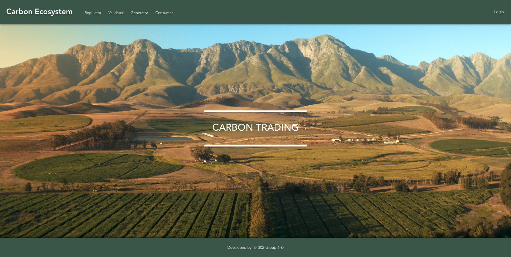

#### Login page

- A login page that prompts for the user's email and password for Firestore authentication. Users are also required to
  specify their role.

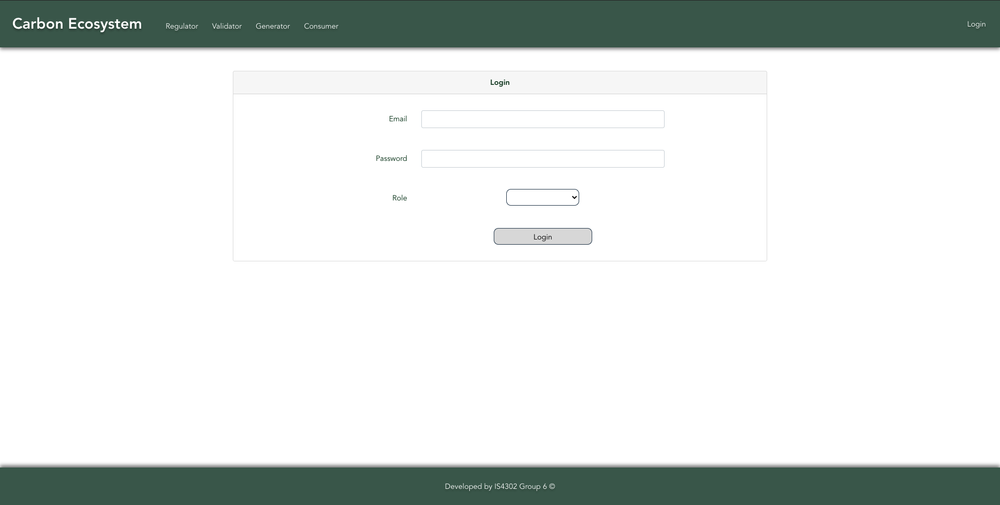

### Role: Regulator

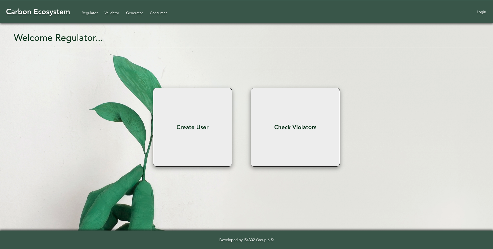

#### Create User

- Regulators will be able to create Generators and Consumers by specifying the User Type, ID and Name.

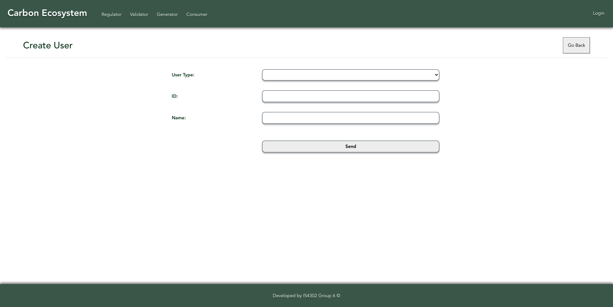

#### Check Violators

- Regulators will be able to retrieve a list of violators.

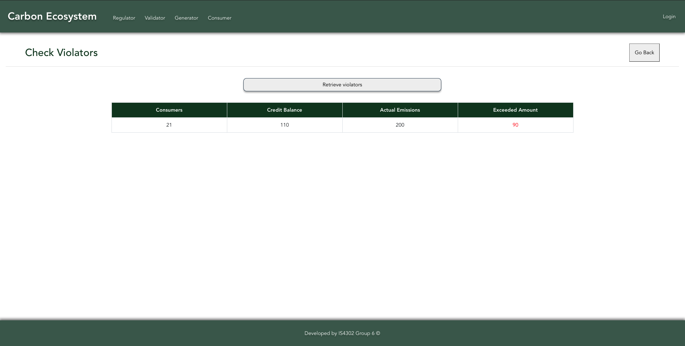

### Role: Validator

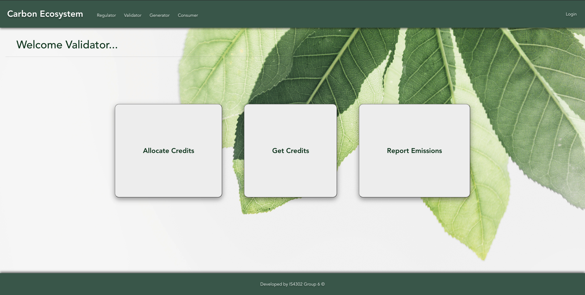

#### Allocate Credits

- To reward Generators for their carbon-reduction projects, Validators will be allowed to allocate credits.


#### Get Credits

- Validators will be able to get the amount of carbon credits of Generators and Consumers.

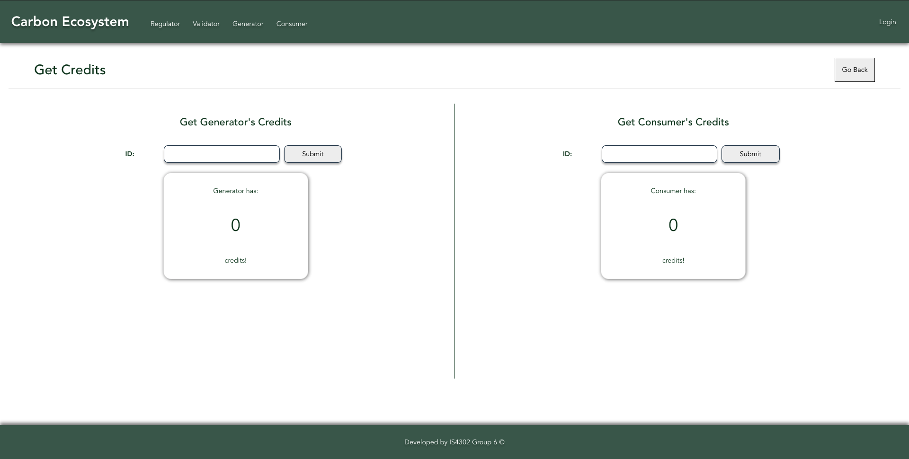

#### Report Emissions

- After verification of emissions, Validators can report the emissions of a Consumer.

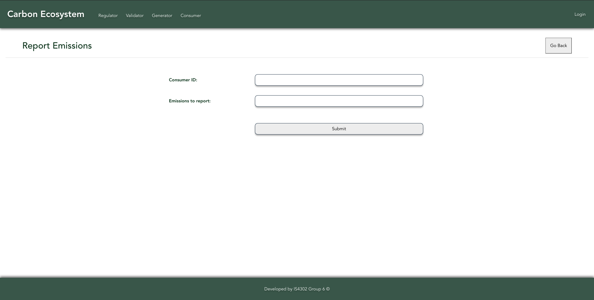

### Role: Generator

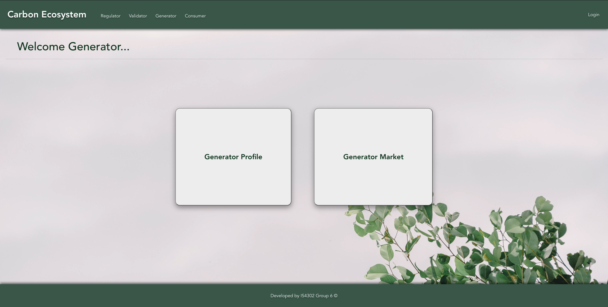

#### Generator Profile

- Generators will be able to retrieve details.

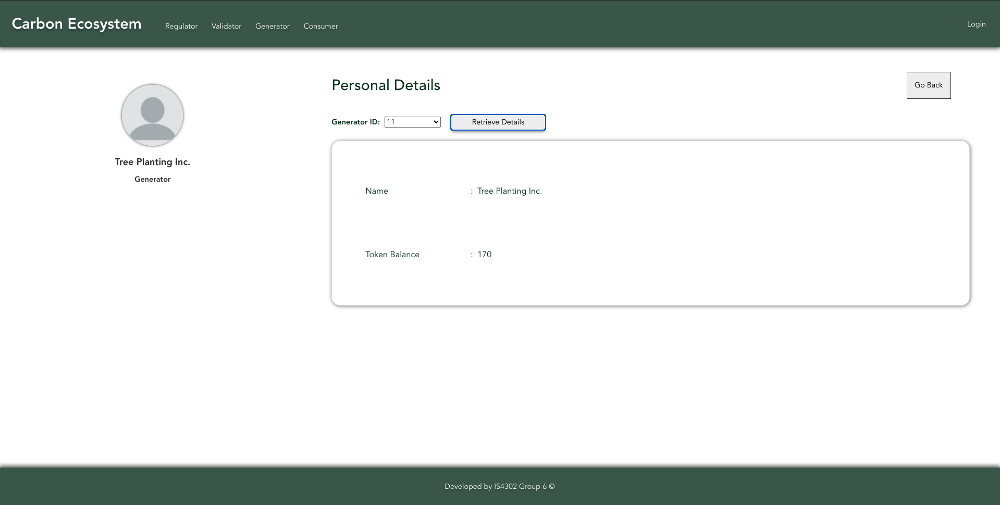

#### Generator Market

- Generators will be able to list credits in the Market by specifying their Generator ID, Price and Quantity.

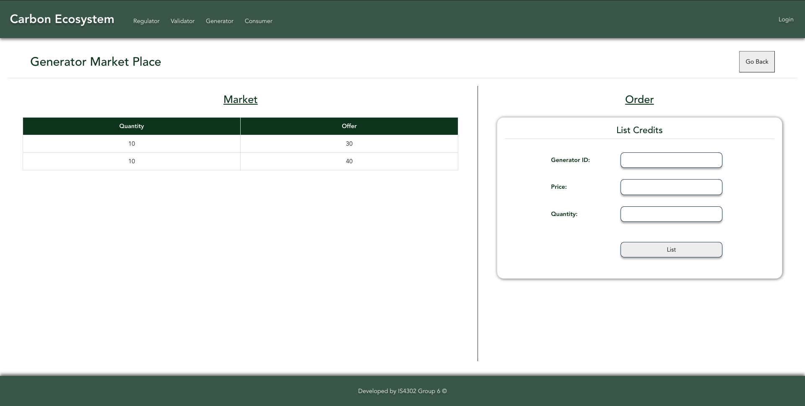

### Role: Consumer

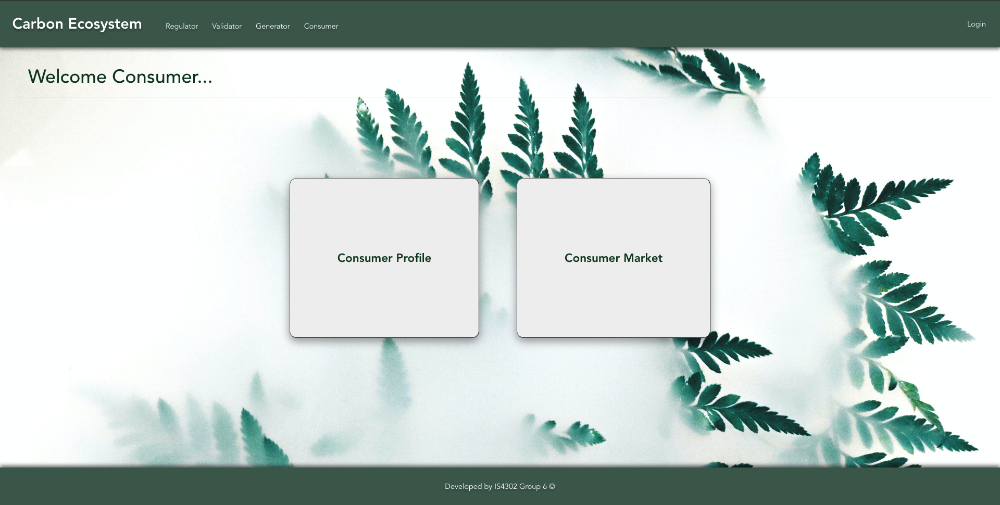

#### Consumer Profile

- Consumers will be able to retrieve details.

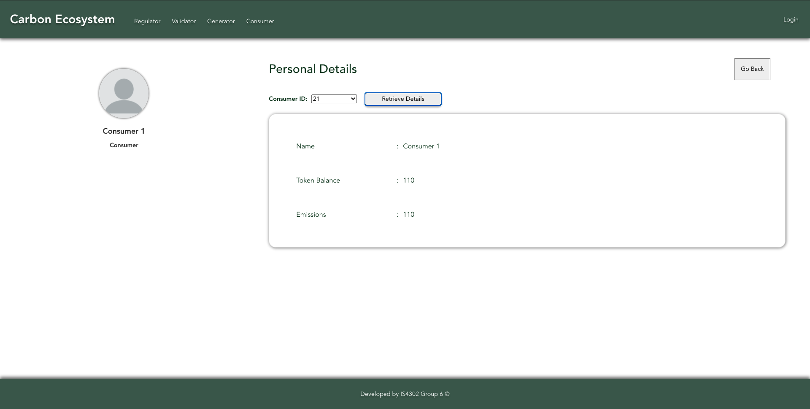

#### Consumer Market

- Consumers will be able to list credits in the Market by specifying their Consumer ID, Price and Quantity. Consumers
  will also be allowed to buy credits by specifying their Consumer ID and Quantity to be bought.

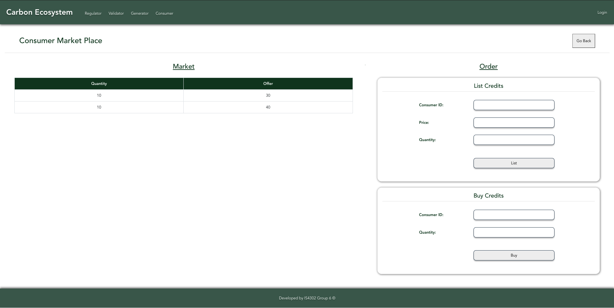
